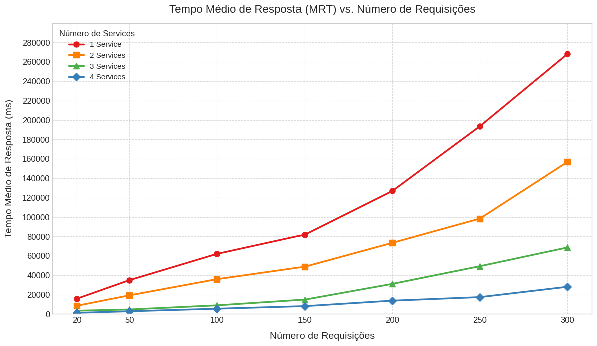

# Trabalho Final - Parte 2: Simulação Distribuída com Docker e Análise de Desempenho

Este projeto evolui a simulação de sistema distribuído da Parte 1, introduzindo o Docker e Docker Compose para orquestração dos componentes. Ele modela um fluxo de processamento de dados mais complexo, com múltiplos estágios de serviços, incluindo um com capacidade de realizar inferência de Inteligência Artificial (IA) usando um modelo BERT para classificação de sentimentos. O foco é analisar o impacto do número de serviços na pipeline e da carga (número de requisições) no Tempo Médio de Resposta (MRT).

## Funcionalidades Principais

*   **Arquitetura Distribuída com Docker:** Todos os componentes (Source, Load Balancers, Services) são executados como contêineres Docker, orquestrados pelo Docker Compose.
*   **Comunicação via Sockets:** A comunicação entre os nós continua sendo via sockets TCP/IP.
*   **Orquestração de Experimentos:** Um script `run_experiments.sh` automatiza a execução de múltiplos cenários, variando:
    *   O número de "serviços ativos" na pipeline (1, 2, 3 ou 4 estágios de processamento).
    *   O número total de requisições geradas (20, 50, 100, 150, 200, 250, 300).
*   **Balanceamento de Carga:** Os Load Balancers distribuem as requisições para os serviços usando uma estratégia Round Robin.
*   **Serviço com IA:** Carrega um modelo BERT pré-treinado para realizar classificação de sentimentos no texto das requisições.
*   **Tempo e Coleta de Métricas:**
    *   Tempos de processamento em cada nó.
    *   Tempos de trânsito da rede entre os nós.
    *   Coleta timestamps em pontos chave (M1-M6) do fluxo.
*   **Configuração Flexível via Variáveis de Ambiente:** Parâmetros como hosts, portas, tempos de processamento, alvos dos LBs e configurações do modelo BERT são gerenciados via variáveis de ambiente e um arquivo `.env`, controlados pelo script orquestrador.
*   **Modularidade:** O código Python é organizado em módulos para cada tipo de componente e utilitários.

## Arquitetura dos Cenários

O trabalho foi configurada para diferentes números de "serviços ativos" na pipeline, onde cada "serviço ativo" representa um estágio de processamento que a requisição atravessa. Os serviços Sx.x são processadores com IA.

*   **1 Serviço Ativo:** `Source -> LB1 -> S1.1 -> Source`
*   **2 Serviços Ativos:** `Source -> LB1 (alvo S1.1) -> S1.1 -> S1.2 -> Source`
*   **3 Serviços Ativos:** `Source -> LB1 (alvos S1.1, S1.2) -> S1.x -> LB2 (alvo S2.1) -> S2.1 -> Source`
*   **4 Serviços Ativos:** `Source -> LB1 (alvos S1.1, S1.2) -> S1.x -> LB2 (alvos S2.1, S2.2) -> S2.x -> Source`

## Análise de Resultados: MRT vs. Número de Requisições

O gráfico abaixo ilustra o Tempo Médio de Resposta (MRT) em segundos em função do número de requisições, para diferentes configurações de "Número de Serviços" ativos na pipeline.



**Interpretação do Gráfico:**

*   **Eixo Y (MRT - segundos):** Representa o tempo médio total que uma requisição leva desde o início de seu preparo no nó `Source` (M1) até o recebimento do resultado final de volta no `Source` (M6).
*   **Eixo X (Número de Requisições):** Indica a carga total de trabalho enviada para o sistema em um determinado experimento.
*   **Linhas Coloridas (Nº de Services):** Cada linha representa uma configuração diferente da pipeline, variando o número de estágios de serviço pelos quais uma requisição passa.
    *   **Vermelho (1 Service):** Pipeline mais curta, com apenas um serviço de processamento (S1.1).
    *   **Laranja (2 Services):** Pipeline com dois serviços de processamento em sequência (S1.1 -> S1.2).
    *   **Verde (3 Services):** Pipeline mais longa, envolvendo dois serviços S1.x e um serviço S2.1, com dois Load Balancers.
    *   **Azul (4 Services):** Pipeline mais complexa, com dois serviços S1.x e dois serviços S2.x, também com dois Load Balancers.

**Observações do Gráfico:**

1.  **Impacto do Número de Serviços:** Como esperado, pipelines com mais serviços (linhas verde e azul) tendem a ter um MRT maior, mesmo para um número menor de requisições. Isso se deve ao tempo de processamento acumulado em cada nó e aos tempos de trânsito entre eles.
2.  **Impacto do Número de Requisições:** Para todas as configurações de serviço, o MRT aumenta com o número de requisições. Este aumento é mais pronunciado para pipelines mais longas e complexas. Isso sugere que, com o aumento da carga, os recursos começam a ser mais disputados, e possíveis gargalos no sistema se tornam mais evidentes.
3.  **Escalabilidade e Gargalos:**
    *   A linha azul (4 Services) mostra o menor aumento no MRT com o aumento das requisições, apesar de ser a pipeline com mais estágios. Isso pode indicar que a paralelização introduzida pelos Load Balancers distribuindo a carga entre duas instâncias de S1.x e duas de S2.x é eficaz em mitigar o aumento do MRT sob carga. Mesmo que cada requisição passe por mais etapas, a capacidade de processar múltiplas requisições em paralelo nos estágios S1 e S2 ajuda a manter o MRT mais baixo em comparação com o que seria se apenas um S1 e um S2 estivessem disponíveis para toda a carga.
    *   A linha vermelha (1 Service) e laranja (2 Services), têm menos paralelismo nos estágios de processamento (ou nenhum no caso de 1 serviço), mostram um crescimento mais acentuado do MRT. Isso pode ser devido ao fato de que, mesmo sendo pipelines mais curtas, o processamento é mais serial para cada requisição dentro daquele único (ou dois) serviço(s) sem a mesma capacidade de distribuição de carga que nas configurações de 3 e 4 serviços.

O gráfico demonstra a complexidade da pipeline e a capacidade do sistema de lidar com diferentes volumes de requisições, destacando a importância do balanceamento de carga e do paralelismo para a escalabilidade.

## Estrutura de Diretórios

```
.
├── Dockerfile              # Define a imagem Docker para os componentes Python
├── docker-compose.yml      # Orquestra os contêineres Docker e suas configurações
├── run_experiments.sh      # Script para automatizar a execução de múltiplos cenários
├── requirements.txt        # Dependências Python
├── config.py               # Configurações base (usadas como fallback ou referência)
├── source.py               # Nó Source, gerador de carga e coletor de resultados
├── loadbalancer.py         # Lógica do nó Load Balancer
├── service.py              # Lógica do nó Service
├── SentimentClassifier.py  # Módulo da classe do classificador de sentimento BERT
├── socket_utils.py         # Funções utilitárias para comunicação via socket
└── README.md               # Este arquivo
```

## Pré-requisitos

*   Docker
*   Docker Compose (v2 ou `docker-compose` standalone)
*   Um ambiente shell (como Bash no Linux/macOS, ou WSL/Git Bash no Windows) para executar o script `.sh`.
*   Python 3.x (para executar `parse_source.py` localmente, se desejado, embora o script o execute no contexto do host).

## Configuração

A maioria das configurações é gerenciada dinamicamente pelo script `run_experiments.sh` através da geração de um arquivo `.env` e da passagem de variáveis de ambiente e perfis para o `docker-compose`.

As configurações base e os valores padrão que o script utiliza podem ser encontrados:
*   No início do script `run_experiments.sh` (listas de `REQUEST_COUNTS`, `NUM_ACTIVE_SERVICES_CONFIGS`).
*   Na seção de geração do `.env` dentro do `run_experiments.sh` (portas, nomes de serviço, tempos de processamento padrão, configurações do BERT).
*   No arquivo `config.py` (usado pelos scripts Python para obter valores padrão ou nomes de serviço, muitos dos quais são sobrescritos por variáveis de ambiente no Docker).

## Como Executar

1.  **Clone o repositório ou certifique-se de que todos os arquivos listados na "Estrutura de Diretórios" estejam no mesmo diretório.**
2.  **Dê permissão de execução ao script:**
    ```bash
    chmod +x run_experiments.sh
    ```
3.  **Execute o script orquestrador:**
    ```bash
    ./run_experiments.sh
    ```

O script irá:
*   Gerar/atualizar o arquivo `.env`.
*   Iterar sobre cada configuração de "número de serviços ativos" e "número de requisições".
*   Para cada combinação:
    *   Executar `docker-compose up` com os perfis e variáveis de ambiente apropriados para construir e iniciar os contêineres do cenário atual. O sistema aguardará o contêiner `source` finalizar.

## Saída Esperada

*   **No console:** Logs do script `run_experiments.sh` indicando o progresso, logs do `docker-compose` e logs do contêiner `source` para cada simulação.

Este processo pode levar um tempo considerável para ser concluído, dependendo do desempenho da máquina e do número de experimentos.

---
