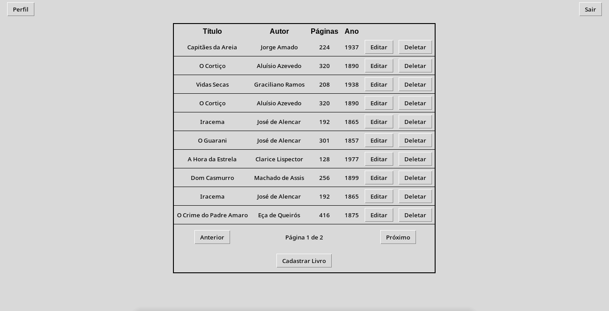

# Sistema de Gestão de Livraria

Aplicativo desktop para gerenciamento de livraria desenvolvido em Python com Tkinter.

## Funcionalidades

- Autenticação de usuários (Login)
- Cadastro de usuário
- Cadastro de livros
- Listagem de livros cadastrados
- Edição de registros existentes
- Logout seguro
- Edição de dados do usuário

## Como Executar

# 1.  Certifique-se de ter Python 3 instalado e o Git.

# 2. Clone o repositório:
   ```bash
   git clone https://github.com/Willians-S-S/SD.git
   ```

# 3. Instale as dependências (Tkinter geralmente vem pré-instalado):
   ```bash
   pip install tk
   pip install firebase-admin
   ```
# 4. Credênciais do firebase:
   ## É necessário criar uma conta no firebase e pegar sua chave de acesso.
   No arquivo crud.py adicione o caminho até seu arquivo com sua KEY do firebase
   ```bash
   cred = credentials.Certificate("caminho/para/sua/credênciais.json")
   ```

# 5. Execução do programa
   O Terminal deve estar no diretório do arquivo main.
   ```bash
   python main.py
   ```

# Fluxo da Aplicação

## Tela de Login
- O usuário insere suas credenciais.
- Após autenticação bem-sucedida, é redirecionado para a **Tela Principal**.


- **Tela Cadastro**: Tela para cadastro de usuário.

## Tela Principal
- **Listagem de Livros**: Exibe todos os livros cadastrados.
- **Excluir Livros**: Opção para remover um livro do sistema.
- **Logout**: Finaliza a sessão do usuário e retorna à tela de login.

- **Cadastrar Novo Livro**: Botão para adicionar um novo livro.

- **Editar Livros**: Permite a modificação dos detalhes de um livro existente.

- **Editar Perfil**: Possibilidade de alterar senha e nome de usuário.

